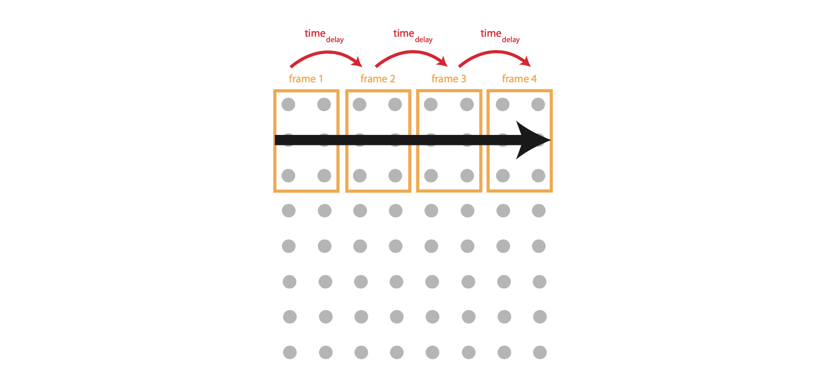

# Active PinScreen Electronics and Microcontroller
Active PinScreen is controlled using a custom-made circuit board, which runs a 8X8 pin array and a Bluetooth module, and provides handles battery charging.

## Getting Start
This repository provides [circuit diagrams](Gerber%20files/), a [bill of materials](Coil%20array%20BOM.xls) and [parts coordinates list](partslist_coil.xls), a [list of commands](Coils-protocol.pdf), and [general hardware documentation](pintoy_paper.pdf).

You will also need the following (or similar), in addition to the circuit board:

* A Bluetooth HC-05 module
* Two lithium-polymer battery
* Optional: Two DPST switchers ([examples](https://onecall.farnell.com/c-k-components/l201011ss03q/slide-switch-dpst-4a-125v-panel/dp/2931771))
* Optional: Two extra 100 kOhm resistors for the battery monitor feature

The prototype’s solenoids are in practice activated one-by-one, their fast response time, combined with pulse-width modulation means that this is imperceptible to the user. Users are able to feel multiple pins simultaneously.

Therefore, the Active PinScreen, can be programed to form a particular pattern based on the "frame" and "sequence" defined in [Coils array communication protocol](Coils-protocol.pdf).
An example of the sequence of left to right directional pattern is shown in the following figure. The stimulation consists of four frames (each consisting of 2 × 3 (W × L) pins). 

## Pattern Programming
In order to create different types of stimuli, we needed to generate a sequence of activated pins in the following way:
* Define a block pattern which is known as a frame. Each pin in a frame will be activated simultaneously (or seemingly so from the user’s perspective, but actually by careful design of the pulse widths and duty cycles of each pin as described below);
* Define the actuation time of each frame, known as time actuation, which is the time each frame continues to be active for;
* Define the frame to frame delay, known as time delay, which refers to the pause between each frame being actuated;
* Create directional pattern by ‘drawing’ each frame on pin array;
* Using the frame and parameters time actuation and time delay, run the stimuli in sequence (i.e., frame by frame)
until the pattern is complete.

## License

This project is licensed under the MIT License - see the [LICENSE](LICENSE) file for details.

The Active PinScreen's prototype designs are released.

## Acknowledgments

* FitLab
* Swansea University
* ...