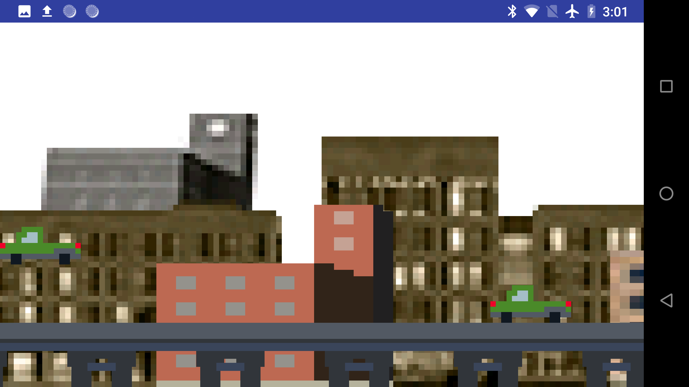

# Endless Runner
Endless Runner is an Android game which work with Active PinScreen. The "[car](car.png)" of the game can jump to avoid crush on "[the other car](car.png)" by tapping on the front screen. The inter-finger stimuli at the back of the device mimic this jump action.

## License

This project is licensed under the MIT License - see the [LICENSE](LICENSE) file for details.

The Active PinScreen's prototype designs, circuit layouts, microcontroller code and accompanying Android app source code are all released.

## Acknowledgments

* FitLab
* Swansea University
* ...