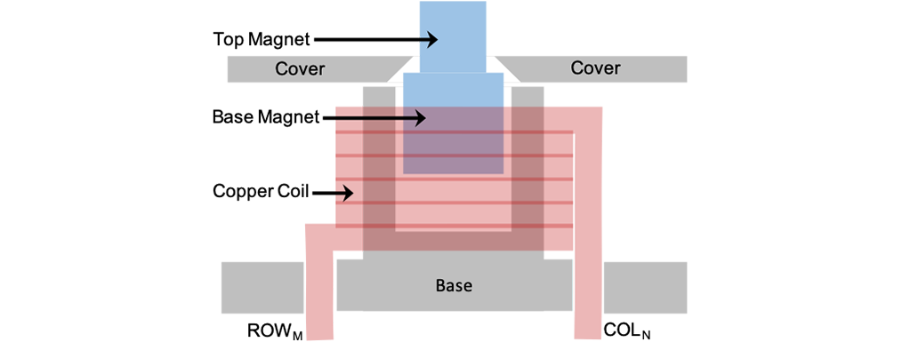

# Active PinScreen Prototype
The prototype can feasibly fit within the casing of a standard smart-phone -- see the following figure.

## Getting Start
The area which provided the tactile feedback are an 8×8 array of pins on the prototype are uniformly distributed over an area of 28 × 28 mm. The blue highlighted area affords the ability to fit comfortably on the back of a standard touchscreen device to provide high-precision feedback to multiple fingers at once. 

A close-up view of the device’s 1 mm diameter pins. A schematic of an individual in unit with its linear solenoid actuator and plunger is shown in the following figure.

* The plungers—the moving pins of the Active PinScreen—are magnetic, and consist of two permanent neodymium magnets.
* The base magnets have a diameter and thickness of 1.5 mm, and slide through the air-core of the solenoid, trapped inside by unit’s top-cover. The top magnets are adhered to the base magnets, and have a diameter and thickness of 1 mm. When activated, these magnets emerge through the unit’s cover and produce the tactile stimulation effect on the user’s fingers.
* The base is made of 8 mm acrylic, and the top cover of the device is a 2 mm aluminium plate.
* The inner tube and the air core for the solenoid in the base plate, and the 1.35 mm holes in the top plate are precisely cut using a CNC machine. A 32 gauge copper wire is wound approximately 25 turns to make each solenoid in the array. The coil ends of each solenoid are connected in rows and columns with a diode and two transistors (N- and P-type MOSFET) used to switch an active-matrix configuration.
* The solenoids are actuated one-at-a-time using a Microchip 18F47J53 8-bit microcontroller, with active matrix layouts transferred via Bluetooth from a smartphone.

## License

This project is licensed under the MIT License - see the [LICENSE](LICENSE) file for details.

The Active PinScreen's prototype designs are released.

## Acknowledgments

* FitLab
* Swansea University
* ...
