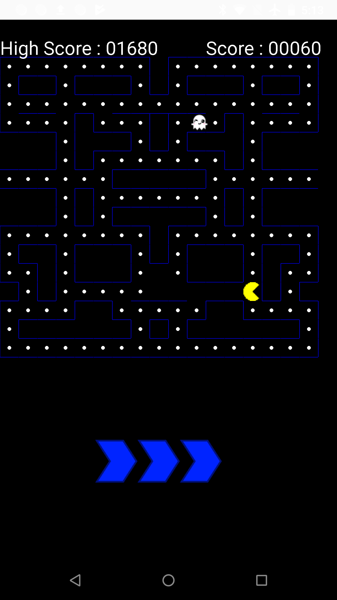

# TacPacMan
TacPacMan is an Android game which work with Active PinScreen. The left/right and up/down swipes on the front screen of the Pacman game are reflected within and inter-finger stimuli at the back of the device.

## License

This project is licensed under the MIT License - see the [LICENSE](LICENSE) file for details.

The Active PinScreen's prototype designs, circuit layouts, microcontroller code and accompanying Android app source code are all released.

## Acknowledgments

* FitLab
* Swansea University
* ...